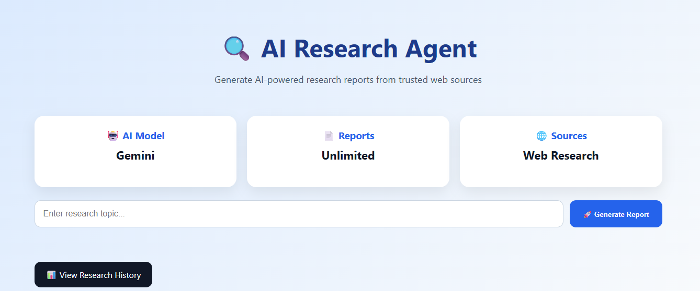
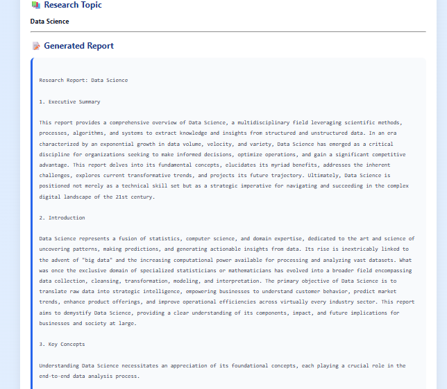
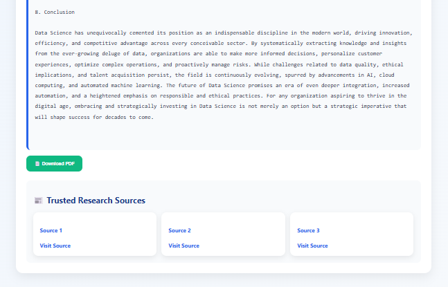

# 🔍 AI Research Agent

An AI-powered research assistant that searches the web, collects relevant information, and generates structured research reports using Google Gemini AI.

## 🚀 Live Demo

**Website:** https://developermehefooz.pythonanywhere.com

## 💻 GitHub Repository

https://github.com/Developermehefooz/AI-Research-Agent

---

## 📌 Features

* 🔍 Search research topics
* 🤖 AI-generated research reports
* 📄 Download reports as PDF
* 📰 Display trusted research sources
* 📚 Research history using SQLite
* 📱 Responsive modern dashboard
* 📊 KPI cards for better UI
* ⏳ Loading spinner while generating reports

---

## 🛠️ Technologies Used

* Python
* Flask
* Google Gemini AI
* BeautifulSoup
* Requests
* SQLite
* ReportLab
* HTML5
* CSS3
* JavaScript

---

## 📂 Project Structure

```
AI-Research-Agent/
│
├── app.py
├── requirements.txt
├── README.md
├── database.db
│
├── static/
│   ├── style.css
│   └── script.js
│
├── templates/
│   ├── index.html
│   └── history.html
│
└── utils/
    ├── search.py
    ├── scraper.py
    ├── summarizer.py
    ├── pdf_generator.py
    └── database.py
```

---

## 📸 Screenshots

### Home Page




### Generated Report



### Research Sources



### Research History


---

## ⚙️ Installation

Clone the repository:

```bash
git clone https://github.com/Developermehefooz/AI-Research-Agent.git
```

Move into the project:

```bash
cd AI-Research-Agent
```

Install dependencies:

```bash
pip install -r requirements.txt
```

Create a `.env` file:

```text
GOOGLE_API_KEY=YOUR_API_KEY
```

Run the application:

```bash
python app.py
```

Open:

```
http://127.0.0.1:5000
```

---

## 📈 Future Improvements

* Faster web search integration
* Better article extraction
* Multiple AI model support
* Dark mode
* Export to DOCX
* Charts and analytics dashboard

---

## 👨‍💻 Author

**Mehefooz Syed**

GitHub: https://github.com/Developermehefooz

LinkedIn: (https://www.linkedin.com/in/sd-mehefooz/)

